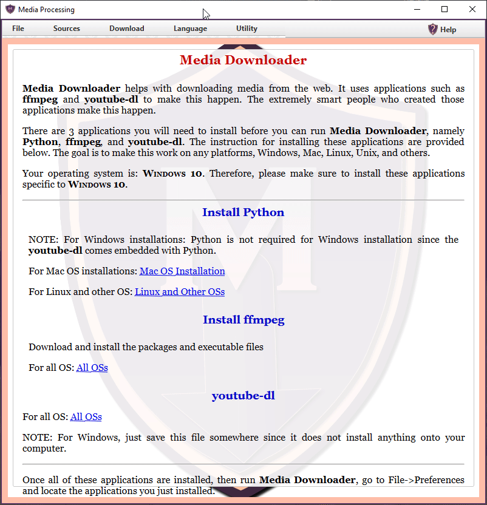

<p align='right'>
	<small>Sunil Samuel<br>
		web_github@sunilsamuel.com<br>
		http://www.sunilsamuel.com
	</small>
</p>

# Introduction

This is a Java JavaFX based application that provides an
interface to the `youtube-dl` and `ffmpeg` applications.
The intent is to provide an easy interface to allow using 
the functionalities of these application so that you can
download and store video and audio from different web sites
including Facebook, YouTube, and lots of others as detailed
in the `youtube-dl` [Youtube-DL](https://github.com/ytdl-org/youtube-dl).

# Technology Stack and Dependencies

* Maven
* Java
* JavaFX
* youtube-dl
* ffmpeg
* python

# Installation

If you are interested in just the application, then download the two
files from the `download` directory, namely
* **media-processing.bat** - A simple Windows batch script.  Double 
click on this .bat file and it will run the application.  This script 
will check to see if you have Java installed and then 
will run the `media-processing.jar` file using command 
`java -jar media-processing.jar`.
* **media-processing.jar** - The java JAR file that is already compiled
and ready to run.

# Run the Application

To run the application on any platform, copy and paste the following
command onto the terminal (cmd, xterm, ...).  Make sure to run this
command in the directory where you downloaded the two applications
see [Installation](#installation):

```java
java -jar media-processing.jar
```

On Windows, you should be able to just double click on the
`media-processing.bat` file and the script will run the command.

Once the application is running, just following the instructions
on the main page.



